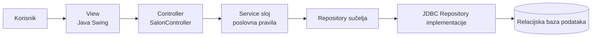
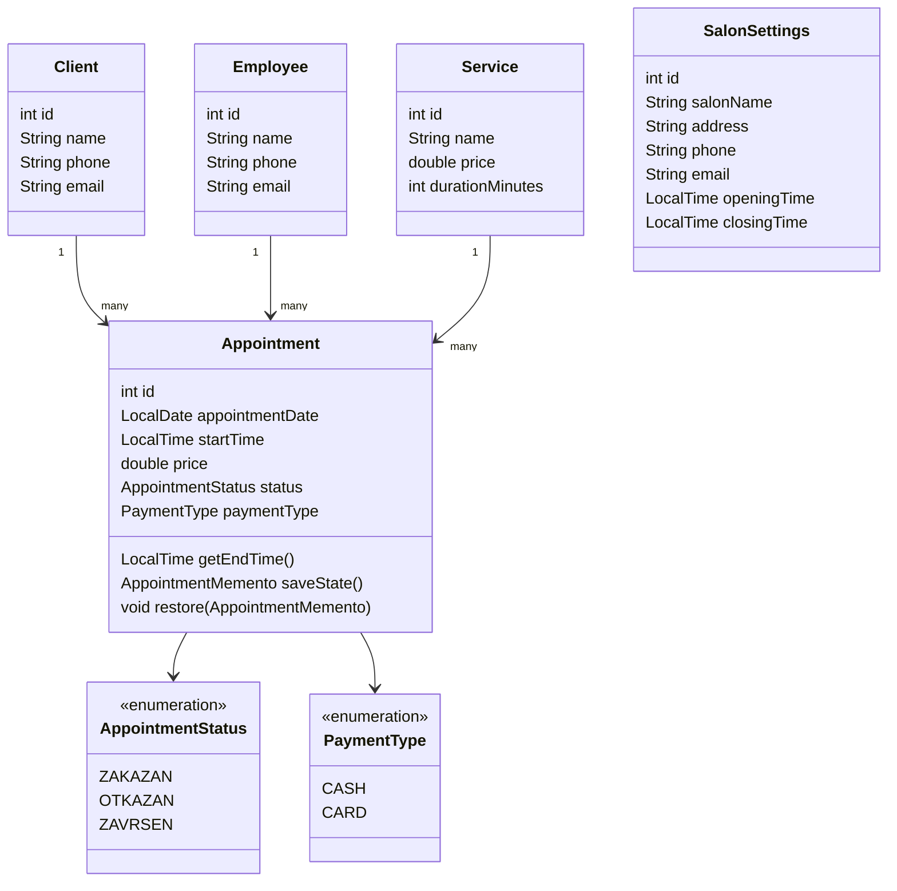
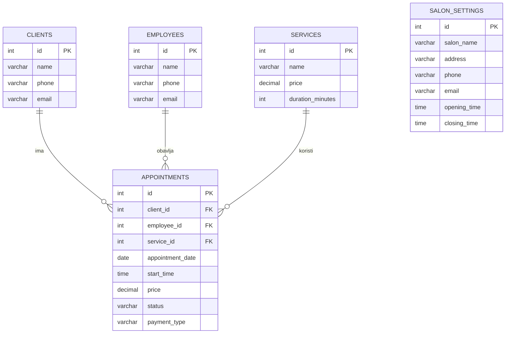

# SalonManager – projektna dokumentacija

## 1. Problem

Frizerski salon treba jedno mjesto za evidenciju klijenata, djelatnika, usluga,
cijena i rezerviranih termina. Ručno vođenje rasporeda otežava provjeru
dostupnosti djelatnika, povećava mogućnost dvostrukog rezerviranja i otežava
čuvanje povijesnih podataka o terminima.

SalonManager rješava taj problem desktop aplikacijom namijenjenom djelatnicima
salona. Podaci se trajno spremaju u relacijsku bazu podataka, a korisnik kroz
jednostavno Swing sučelje upravlja svim osnovnim podacima i terminima.

## 2. Način rješenja

Aplikacija omogućuje:

- dodavanje, pregled i uređivanje klijenata i djelatnika
- definiranje usluga, cijena i trajanja usluge u minutama
- kreiranje, uređivanje, otkazivanje i završavanje termina
- odabir načina plaćanja `CASH` ili `CARD`
- izračun očekivanog završetka termina
- provjeru preklapanja termina istog djelatnika
- provjeru radnog vremena salona
- spremanje cijene termina kao snapshot vrijednosti u trenutku rezervacije
- poništavanje posljednje promjene termina unutar trenutne sesije
- upravljanje nazivom, kontaktom i radnim vremenom salona

Prilikom spremanja ili pomicanja termina provjera dostupnosti i spremanje
izvode se u istoj JDBC transakciji. Time se smanjuje mogućnost da dvije
istodobne operacije rezerviraju isti termin.

## 3. Arhitektura

Projekt koristi MVC pristup uz odvojeni Service i Repository sloj:



View prikuplja korisnički unos i prikazuje podatke. Controller obrađuje akcije
iz sučelja i prosljeđuje ih Service sloju. Service sloj provodi poslovna
pravila, a Repository sloj skriva JDBC i SQL detalje.

## 4. Wireframeovi korisničkog sučelja

Glavni prozor koristi kartice koje odgovaraju konceptu aplikacije.

### Termini

```text
+--------------------------------------------------------------------------------+
| SalonManager                                                                   |
| [Termini] [Klijenti] [Djelatnici] [Usluge] [Postavke]                         |
|                                                                                |
| Klijent | Djelatnik | Usluga | Datum | Vrijeme | Završetak | Cijena | Status  |
| --------+-----------+--------+-------+---------+-----------+--------+---------|
| ...                                                                            |
|                                                                                |
| [Dodaj] [Uredi] [Otkaži] [Završi] [Poništi] [Osvježi]                         |
+--------------------------------------------------------------------------------+
```

Forma za termin sadrži odabir klijenta, djelatnika, usluge, datum, početno
vrijeme i način plaćanja. Očekivano vrijeme završetka prikazuje se odmah nakon
odabira usluge i vremena.

### Klijenti i djelatnici

```text
+--------------------------------------------------+
| Dodaj / Uredi                                     |
|                                                  |
| Ime:      [                              ]       |
| Telefon:  [                              ]       |
| Email:    [                              ]       |
|                                                  |
|                         [Spremi] [Odustani]      |
+--------------------------------------------------+
```

Pregled klijenata i djelatnika prikazuje tablicu s osnovnim kontaktnim
podacima te gumbe za dodavanje, uređivanje, brisanje i osvježavanje.

### Usluge i postavke

Usluge se prikazuju s nazivom, cijenom i trajanjem u minutama. Postavke salona
prikazuju naziv, adresu, telefon, email te početak i završetak radnog vremena.

## 5. Domenski model

Domenski model sastoji se od klasa `Client`, `Employee`, `Service`,
`Appointment` i `SalonSettings`. `Appointment` povezuje klijenta, djelatnika i
uslugu. Status i način plaćanja modelirani su enum tipovima
`AppointmentStatus` i `PaymentType`.

Izvorni UML dijagram nalazi se u `docs/dijagrami/klase.mmd`.



## 6. Baza podataka

Baza sadrži tablice `clients`, `employees`, `services`, `appointments` i
`salon_settings`. Tablica `appointments` ima strane ključeve prema klijentu,
djelatniku i usluzi. Cijena u toj tablici nije izračunata svaki put iz cjenika,
nego je snapshot cijene usluge pri stvaranju termina.

Izvorni ERD dijagram nalazi se u `docs/dijagrami/erd.mmd`.



Fizičko brisanje klijenta, djelatnika ili usluge koji su već povezani s
terminom nije dopušteno jer strani ključevi čuvaju povijesni integritet.

## 7. Obrasci dizajna

### MVC

MVC je osnovni arhitekturni obrazac. `view` sadrži Swing komponente,
`SalonController` obrađuje događaje, a Service i Repository slojevi odvojeni
su od prikaza.

### Command

Promjena, otkazivanje i završavanje termina predstavljeni su Command objektima
s metodama `execute()` i `undo()`. `CommandInvoker` čuva posljednju izvršenu
operaciju u trenutnoj sesiji.

### Memento

`AppointmentMemento` čuva datum, vrijeme, cijenu, status i način plaćanja prije
promjene. Command koristi Memento kako bi mogao vratiti prethodno stanje i
ponovno ga spremiti u bazu.

Strategy, Singleton i Observer nisu korišteni jer u ovoj verziji ne rješavaju
konkretan problem aplikacije, što odgovara odobrenom konceptu.

## 8. Korištene biblioteke

- Java Swing i JDBC: službena Java API dokumentacija
  - <https://docs.oracle.com/en/java/javase/17/docs/api/java.desktop/javax/swing/package-summary.html>
  - <https://docs.oracle.com/en/java/javase/17/docs/api/java.sql/java/sql/package-summary.html>
- H2 Database za lokalnu relacijsku bazu i integracijske testove:
  <https://h2database.com/html/main.html>
- JUnit 5 za jedinične i integracijske testove:
  <https://junit.org/junit5/docs/current/user-guide/>

## 9. Testiranje

`AppointmentServiceTest` provjerava preklapanje termina, radno vrijeme,
prijelaze statusa, snapshot cijene i Command/Memento undo.

`JdbcRepositoryIntegrationTest` provjerava JDBC spremanje i dohvaćanje,
postavke salona te zabranu brisanja podataka koji su povezani s terminom.

Testovi se pokreću naredbom:

```text
mvn clean test
```

## 10. Javadoc i Git povijest

Javadoc API dokumentacija generira se naredbom:

```text
mvn javadoc:javadoc
```

Razvoj je podijeljen u manje funkcionalne commitove. Sažetak povijesti:

```text
chore: initialize SalonManager Maven project
feat(model): add salon domain objects
feat(repository): add JDBC persistence and database schema
feat(service): implement salon business rules
feat(undo): add Command and Memento appointment workflow
feat(ui): add Swing screens and forms
test: cover appointment rules and undo behavior
test: add JDBC repository integration coverage
```

Git graf može se prikazati naredbom:

```text
git log --graph --oneline --decorate --all
```
